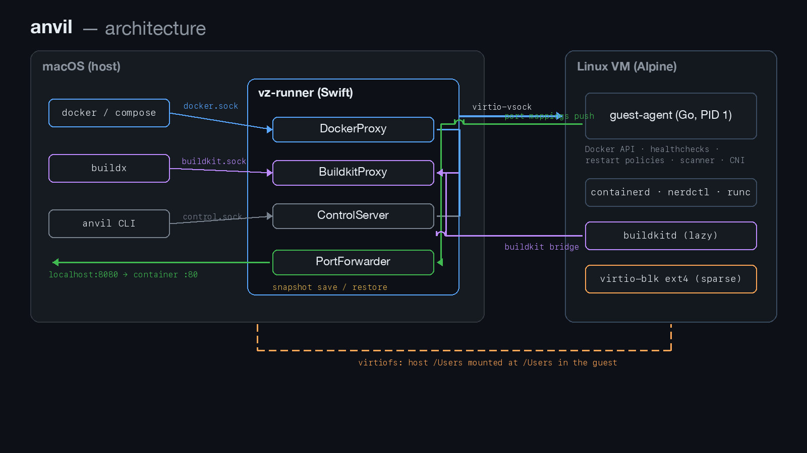

# Anvil

[](https://github.com/olegshirko/anvil/actions/workflows/go.yml)
[](LICENSE)


A minimal, fast alternative to Lima / Docker Desktop / OrbStack for running
Docker containers on macOS (Apple Silicon only). One host process, one tiny
Linux VM, no SSH, no systemd, no background fleet of helpers.


Real session, timings from `/usr/bin/time -p`: resume + `docker run --rm
alpine` in half a second. (The 1.55 s `anvil start` includes ~1 s of
docker-CLI bootstrap — context switch and buildx builder selection; the VM
itself is restored from a memory snapshot in 0.5 s.)

## Why

| Metric | **anvil** | colima | lima | orbstack | docker-desktop | apple-containers |
|---|---|---|---|---|---|---|
| Cold start (daemon ready) | 613 ms | 12107 ms | 8682 ms | 1972 ms | 5643 ms | **520 ms** |
| Cold start: compose up (all healthy) | **792 ms** | 1456 ms | 1435 ms | 3436 ms | 1550 ms | 2598 ms |
| Resume (daemon ready) | 742 ms | 9228 ms | 5768 ms | 1586 ms | 5616 ms | **269 ms** |
| Resume: compose up (all healthy) | **734 ms** | 1439 ms | 1394 ms | 1495 ms | 1476 ms | 2377 ms |
| Idle RSS | **1139 MB** | 2185 MB | 2057 MB | 2201 MB | 1220 MB | 2057 MB |

Full methodology and workloads: [bench-harness/](bench-harness/README.md).
Apple Containers has no compose API: the same stack is started there as four
plain `container run` calls, and its "resume" is a second cold start (no
snapshot API) — the apiserver itself is a lightweight launchd service, which
is why daemon-ready is fast while bringing the stack up is not.

The speed comes from two decisions: the VM is paused into a **memory snapshot**
after boot and restored from it (no re-boot, no re-provisioning), and the whole
data path is **virtio-vsock + virtiofs**, with no SSH, no port-forwarding
daemons and no userspace network stack in between.

## Requirements

- macOS 14+ on Apple Silicon
- Docker CLI (any recent `docker` / `docker compose` client — e.g.
  `brew install docker docker-compose`; the CLI is enough, anvil supplies
  the daemon)
- For building from source: Xcode/Swift toolchain, Go, and either a Lima VM
  named `anvil` or a local Docker for the initramfs build

## Install

### Homebrew

```sh
brew install olegshirko/tap/anvil
anvil start        # first run is a cold boot (~0.6 s), then a snapshot is saved
```

### zerobrew

The same tap works with zerobrew:

```sh
zerobrew install olegshirko/tap/anvil
anvil start
```

zerobrew has no `brew services`, so the LaunchAgent for autostart at login is
not installed automatically — run `anvil start` after login instead. `anvil
start` also unpacks the gzipped kernel itself when the service wrapper has
not done it, so no extra steps are needed.

### From source

```sh
git clone https://github.com/olegshirko/anvil.git
cd anvil
make rebuild-all      # vz-runner (signed) + guest-agent + initramfs
make service-start    # background daemon + docker context
```

`make service-install` registers a LaunchAgent so anvil starts at login.

### Uninstall

```sh
anvil stop
brew uninstall olegshirko/tap/anvil      # or: make service-uninstall for source installs
docker context rm anvil
rm -rf ~/.anvil-vz                        # snapshot + sparse containerd disk — frees all VM data
```

If you registered the LaunchAgent (`make service-install` / Homebrew
`brew services`), uninstall it first: `make service-uninstall` (from a source
checkout) or `launchctl bootout gui/$(id -u)
~/Library/LaunchAgents/com.olegshirko.anvil.plist`.

## Usage

Anvil is a Docker **context** — after `anvil start` your normal Docker CLI
talks to it:

```sh
docker context use anvil        # done automatically by `anvil start`
docker run --rm -p 8080:80 nginx
docker compose up               # compose works: networks, volumes, events
docker build -t myimg .         # buildx remote driver against in-VM buildkitd
docker run -v $HOME/proj:/data alpine ls /data   # macOS bind mounts
```

`anvil start` creates a buildx builder named `anvil-remote` (remote driver pointing
at the VM's buildkitd through `~/.anvil-vz/buildkit.sock`) and selects it;
`anvil stop` restores your previous builder. With the remote driver,
`docker build` needs `--load` to import the result into the image store
(compose does this automatically on `compose build`). The classic
`DOCKER_BUILDKIT=0 docker build` path works too.

Host ports of published containers are forwarded to `localhost` automatically.

### CLI

```
anvil start      Launch the daemon, wait for ready, switch docker context
anvil stop       Stop the daemon, restore the previous docker context
anvil restart    Stop + start
anvil status     Daemon + guest readiness (usable as a health gate)
anvil doctor     Diagnose install: hypervisor, signing, assets, API, shares (--json for scripts)
anvil logs       Tail daemon/console/guest logs
anvil exec ...   Run a command inside the VM (debugging)
anvil images     Manage the image-mirror fallback (list / check / request)
```

Housekeeping lives in the Makefile: `make prune` (remove containers/volumes/
images inside the VM), `make disk-compact` (reclaim host space from the
sparse containerd disk after a prune — logical size and snapshot stay
intact).

### Configuration (environment variables)

| Variable | Default | Purpose |
|---|---|---|
| `ANVIL_MEMORY` | `2` | VM RAM in GiB |
| `ANVIL_DISK_GB` | `64` | containerd disk size (sparse; existing disks only grow, guest fs is resized online) |
| `ANVIL_SHARE_USERS` | `1` | Set to `0` to disable sharing the host `/Users` tree into the VM |
| `DEBUG` | — | `1` enables guest-agent debug log (`guest-agent.log` on the share) |

### Troubleshooting

Start with `anvil doctor` — it checks hypervisor entitlements, code signing,
assets, the Docker API endpoint and shares, and points at the failing part.
Add `--json` for machine-readable output (exit code is non-zero on any
failure either way, so plain `anvil doctor` works as a health gate in
scripts).

Common situations:

- **"Operation not permitted" / VM fails to start** — the binary lost its
  codesign with the `com.apple.security.hypervisor` entitlement (typical after
  a manual rebuild): run `make sign`. The Homebrew bottle is signed in CI.
- **A config change forced a cold boot** — the snapshot is keyed by a hash of
  kernel/initrd/CPU/RAM/disk/shares, so changing `ANVIL_MEMORY` or
  `ANVIL_DISK_GB` (or updating anvil) intentionally discards the old snapshot.
  This is not an error; the next start is simply a ~0.6 s cold boot.
- **Port conflicts** — published ports are bound on `localhost`; if another
  service holds the port, the container starts but the forward fails — check
  `anvil logs`.
- **Fresh clues** — `anvil logs` tails daemon, VM console and guest-agent
  logs; `anvil exec <cmd>` runs a command inside the VM for deeper
  debugging.

## Architecture

Two processes total. A Swift host daemon (`vz-runner`) that owns the VM,
and a static Go binary (`guest-agent`) that is PID 1 inside it. Your
`docker` CLI never knows the difference — it talks to a unix socket that
gets proxied, byte for byte, into the VM:



What a `docker run` actually does: the CLI POSTs to `docker.sock` →
vz-runner pumps the bytes over virtio-vsock → guest-agent translates the
Docker API into native containerd calls, tracks ports and policies →
the port scanner pushes the new mappings back over vsock → vz-runner
opens a `localhost` listener and relays into the guest. No daemon chain
on the host, no network stack in userspace.

Why it's fast — the decisions that matter:

- **Snapshot resume, not reboot.** After the first boot the VM is paused
  into a memory snapshot. Every later start is a restore (~0.5 s): no
  kernel boot, no provisioning, no DHCP. The snapshot is keyed by a hash
  of kernel/initrd/CPU/RAM/disk/shares — any config change falls back to
  a cold boot instead of restoring a stale guest.
- **No SSH, no systemd, no fleet.** guest-agent is PID 1: it mounts
  filesystems, starts containerd, reaps zombies, serves the API. The
  proxies are plain POSIX byte-pumps — Network.framework's TLS machinery
  and event loops would be pure overhead here.
- **The Docker API is emulated, precisely.** guest-agent implements the
  slice the CLI actually uses — including the undocumented invariants
  (`/_ping` identity headers, `/wait` streaming before blocking,
  deterministic container IDs) that make the real client behave.
- **A real disk, tuned.** Images and volumes live on a sparse raw
  virtio-blk disk (ext4 with writeback tuning; host writeback cache,
  durability traded for speed — the snapshot is the safety net). It
  grows automatically with online `resize2fs`, and daily `fstrim`
  returns space to the host after you delete images.
- **Bind mounts like Docker Desktop.** The host `/Users` tree is shared
  via virtiofs and mounted at the *same absolute path*, so
  `-v $HOME/...:/path` and compose relative volumes need no rewriting.
- **Per-project networking.** Each compose project gets its own containerd
  namespace and CNI bridge; subnets are deterministic per project name.
- **`docker build`, natively.** buildkitd runs in the guest and is reached
  two ways: the socket is forwarded to the host
  (`~/.anvil-vz/buildkit.sock`) for the buildx remote driver, and plain
  `docker build` / `docker compose build` go through a gRPC bridge on the
  Docker API socket straight into the same buildkitd — no moby/buildkit
  container is ever pulled. buildkitd starts lazily — nothing runs until
  your first build.

The full rationale — every trade-off, benchmark, and post-mortem — is in
[ARCHITECTURE.md](ARCHITECTURE.md).

## Current limitations

- Apple Silicon only; no amd64 emulation yet (Rosetta support is planned).
- With the remote buildx driver, plain `docker build` keeps the result in the
  build cache — add `--load` to import it into the image store (compose does
  this automatically). The buildx `docker-container` driver (which pulls a
  moby/buildkit image) does not work.
- `docker events --since` replays only what the in-memory event log kept
  (last 1024 events since first boot — the buffer survives snapshot pauses);
  live events, `--until` and filters are unaffected.
- Docker API is emulated, not complete: it covers what `docker` CLI and
  `docker compose` actually use. Swarm, plugins and some prune endpoints are
  out of scope.
- The control socket is unauthenticated (local-user trust model) — do not
  expose it.

## Development

```sh
make service-debug-rebuild   # rebuild everything, cold boot with debug logs
make validate                # robustness suite (save/resume, kill -9, FD leaks, CNI)
make harness                 # benchmarks against Lima/Colima/OrbStack/Docker Desktop/Apple Containers
make test                    # sign + unit tests (Go guest-agent, Swift host)
```

Layout: `Sources/vz-runner/` (Swift host daemon, one file ≈ one component),
`guest-agent/` (Go, organized by Docker API domain), `scripts/` (initramfs
build + service wrapper), `bench-harness/` (benchmarks),
`ARCHITECTURE.md` (design decisions).

Releases: `make release VERSION=x.y.z` — update [CHANGELOG.md](CHANGELOG.md),
tag, GitHub Actions build + codesign, Homebrew tap update. The release notes
are generated from the conventional-commit history
(`make release-notes` previews them).

## License

Apache-2.0 — see [LICENSE](LICENSE).
