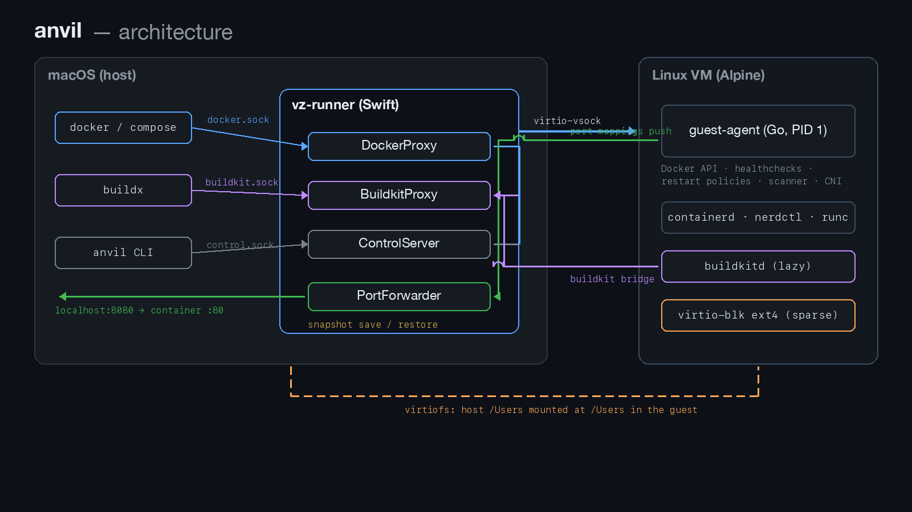

# Anvil

[](https://github.com/olegshirko/anvil/actions/workflows/go.yml)
[](LICENSE)


A minimal, fast alternative to Lima / Docker Desktop / OrbStack for running
Docker containers on macOS (Apple Silicon only). One host process, one tiny
Linux VM, no SSH, no systemd, no background fleet of helpers.


Real session, timings from `/usr/bin/time -p`: `anvil start` restores the
VM from a memory snapshot in 0.8 s; `docker run --rm alpine` answers in
under a second (most of that is docker-CLI bootstrap — the daemon-side
work is ~0.1 s); a warm `docker compose up -d` with two services takes
0.2 s.

## Why

| Metric | **anvil** | colima | lima | orbstack | docker-desktop | apple-containers |
|---|---|---|---|---|---|---|
| Cold start (daemon ready) | 732 ms | 12107 ms | 8682 ms | 1972 ms | 5643 ms | **520 ms** |
| Cold start: compose up (all healthy) | 1573 ms | 1456 ms | **1435 ms** | 3436 ms | 1550 ms | 2598 ms |
| Resume (daemon ready) | 486 ms | 9228 ms | 5768 ms | 1586 ms | 5616 ms | **269 ms** |
| Resume: compose up (all healthy) | 1555 ms | 1439 ms | **1394 ms** | 1495 ms | 1476 ms | 2377 ms |
| Idle RSS | 1225 MB | 2185 MB | 2057 MB | 2201 MB | **1220 MB** | 2057 MB |

Full methodology and workloads: [bench-harness/](bench-harness/README.md).
Apple Containers has no compose API: the same stack is started there as four
plain `container run` calls, and its "resume" is a second cold start (no
snapshot API) — the apiserver itself is a lightweight launchd service, which
is why daemon-ready is fast while bringing the stack up is not.

The speed comes from two decisions: the VM is paused into a **memory snapshot**
after boot and restored from it (no re-boot, no re-provisioning), and the whole
data path is **virtio-vsock + virtiofs**, with no SSH, no port-forwarding
daemons and no userspace network stack in between.

## Requirements

- macOS 14+ on Apple Silicon
- Docker CLI (any recent `docker` / `docker compose` client — e.g.
  `brew install docker docker-compose`; the CLI is enough, anvil supplies
  the daemon)
- For building from source: Xcode/Swift toolchain, Go, and either a Lima VM
  named `anvil` or a local Docker for the initramfs build

## Install

### Homebrew

```sh
brew install olegshirko/tap/anvil
anvil start        # first run is a cold boot (~0.6 s), then a snapshot is saved
```

### zerobrew

The same tap works with zerobrew:

```sh
zerobrew install olegshirko/tap/anvil
anvil start
```

zerobrew has no `brew services`, so the LaunchAgent for autostart at login is
not installed automatically — run `anvil start` after login instead. `anvil
start` also unpacks the gzipped kernel itself when the service wrapper has
not done it, so no extra steps are needed.

### From source

```sh
git clone https://github.com/olegshirko/anvil.git
cd anvil
make rebuild-all      # vz-runner (signed) + guest-agent + initramfs
make service-start    # background daemon + docker context
```

`make service-install` registers a LaunchAgent so anvil starts at login. It
runs `anvil-service.sh run`, which keeps the daemon in the foreground so
launchd restarts it if it crashes (a stop or SIGTERM ends it for good).

### Uninstall

```sh
anvil stop
brew uninstall olegshirko/tap/anvil      # or: make service-uninstall for source installs
docker context rm anvil
rm -rf ~/.anvil-vz                        # snapshot + sparse containerd disk — frees all VM data
```

If you registered the LaunchAgent (`make service-install` / Homebrew
`brew services`), uninstall it first: `make service-uninstall` (from a source
checkout) or `launchctl bootout gui/$(id -u)
~/Library/LaunchAgents/com.olegshirko.anvil.plist`.

## Usage

Anvil is a Docker **context** — after `anvil start` your normal Docker CLI
talks to it:

```sh
docker context use anvil        # done automatically by `anvil start`
docker run --rm -p 8080:80 nginx
docker compose up               # compose works: networks, volumes, events
docker build -t myimg .         # buildx remote driver against in-VM buildkitd
docker run -v $HOME/proj:/data alpine ls /data   # macOS bind mounts
```

Tools that do not read the docker context — Testcontainers (Java, Go,
Node, Python), some IDE plugins — need the socket spelled out:

```sh
export DOCKER_HOST=unix://$HOME/.anvil-vz/docker.sock
# or, for Testcontainers only, in ~/.testcontainers.properties:
#   docker.host=unix:///Users/<you>/.anvil-vz/docker.sock
```

Ryuk and other containers that mount that socket get the VM's own
`/run/docker.sock`; no `TESTCONTAINERS_DOCKER_SOCKET_OVERRIDE` is needed.

`anvil start` creates a buildx builder named `anvil-remote` (remote driver pointing
at the VM's buildkitd through `~/.anvil-vz/buildkit.sock`) and selects it;
`anvil stop` restores your previous builder. With the remote driver,
`docker build` needs `--load` to import the result into the image store
(compose does this automatically on `compose build`). The classic
`DOCKER_BUILDKIT=0 docker build` path works too.

Host ports of published containers are forwarded to `localhost` automatically.

### CLI

```
anvil start      Launch the daemon, wait for ready, switch docker context
anvil stop       Stop the daemon, restore the previous docker context
anvil restart    Stop + start
anvil status     Daemon + guest readiness (usable as a health gate)
anvil doctor     Diagnose install: hypervisor, signing, assets, API, shares (--json for scripts)
anvil logs       Tail daemon/console/guest logs
anvil exec ...   Run a command inside the VM (debugging)
anvil images     Manage the image-mirror fallback (list / check / request)
anvil prune      Remove all containers, unused images/volumes/networks and the build cache (-f skips the prompt)
anvil disk-compact  Give space freed in the VM back to macOS (stops the daemon; snapshot stays valid)
```

`make prune` / `make disk-compact` do the same from a source checkout. The
VM also trims its disk before every idle pause.

Logs: `~/.anvil-vz/daemon.log` (host daemon), `~/.anvil-vz/console.log` (VM
console), and after a `DEBUG=1` cold boot (`make service-debug`) the guest
agent's `<share>/.anvil-run/guest-agent.log` (the project directory in a source
tree, `~/.anvil-vz` otherwise). `anvil logs [daemon|console|guest]` tails them.

### Configuration (environment variables)

Set them in the environment or, to make them stick for `anvil start`, the
LaunchAgent and `brew services` alike, as `KEY=VALUE` lines in
`~/.anvil-vz/config` (the environment wins). Changing memory, CPUs or disk
size changes the snapshot key, so the next start is a cold boot.

| Variable | Default | Purpose |
|---|---|---|
| `ANVIL_MEMORY` | `2` | VM RAM in GiB |
| `ANVIL_CPUS` | — | VM CPU count (unset = vz-runner default of 2) |
| `ANVIL_DISK_GB` | `64` | containerd disk size (sparse; existing disks only grow, guest fs is resized online) |
| `ANVIL_SHARE_USERS` | `1` | Shares the Mac's `/Users`, `/Volumes`, `/tmp` and `/var/folders` into the VM at the same paths (Docker Desktop's defaults), so bind mounts of them work; a missing `-v` source elsewhere is refused ("mounts denied") rather than created in VM memory; `0` disables sharing |
| `ANVIL_SHARE_EXTRA` | `volumes,tmp,varfolders` | Which of the extra shares (`/Volumes`, `/tmp`, `/var/folders`) to set up; empty for none |
| `ANVIL_IDLE` | `600` | Seconds without Docker clients, forwarded connections or running containers before the VM is paused into its snapshot |
| `ANVIL_IDLE_RELEASE` | `900` | Seconds the VM stays idle-paused before it is stopped to give its memory back to macOS (the next Docker command restores it from the snapshot in ~0.5 s); `0` keeps it paused |
| `ANVIL_ROSETTA` | `0` | Set to `1` to run `linux/amd64` containers through Rosetta (needs `softwareupdate --install-rosetta`; changing it forces one cold boot) |
| `DEBUG` | — | `1` enables host-side debug logs; the guest-agent debug log (`guest-agent.log` on the share) needs a cold boot (`make service-debug`), a resumed VM keeps its old setting |

### Troubleshooting

Start with `anvil doctor` — it checks hypervisor entitlements, code signing,
assets, the Docker API endpoint and shares, and points at the failing part.
Add `--json` for machine-readable output (exit code is non-zero on any
failure either way, so plain `anvil doctor` works as a health gate in
scripts).

Common situations:

- **"Operation not permitted" / VM fails to start** — the binary lost its
  codesign with the `com.apple.security.hypervisor` entitlement (typical after
  a manual rebuild): run `make sign`. The Homebrew bottle is signed in CI.
- **A config change forced a cold boot** — the snapshot is keyed by a hash of
  kernel/initrd/CPU/RAM/disk/shares, so changing `ANVIL_MEMORY` or
  `ANVIL_DISK_GB` (or updating anvil) intentionally discards the old snapshot.
  This is not an error; the next start is simply a ~0.6 s cold boot.
  Containers, images and volumes survive it, as they survive a Docker daemon
  restart: containers that were running show `Exited (255)`, and
  `--restart always` (and `unless-stopped`, unless you stopped it) start
  again; `--rm` containers are removed.
- **A start right after the Mac was locked is a cold boot** —
  Virtualization.framework seals the saved VM state with a Secure Enclave
  key that is unusable while the screen is locked ("failed to restore with
  error permission denied" in `daemon.log`). Containers, images and volumes
  survive the cold boot.
- **Port conflicts** — published ports are bound on `localhost`; if another
  service holds the port, the container starts but the forward fails — check
  `anvil logs`.
- **Fresh clues** — `anvil logs` tails daemon, VM console and guest-agent
  logs; `anvil exec <cmd>` runs a command inside the VM for deeper
  debugging.

## Architecture

Two processes total. A Swift host daemon (`vz-runner`) that owns the VM,
and a static Go binary (`guest-agent`) that is PID 1 inside it. Your
`docker` CLI never knows the difference — it talks to a unix socket that
gets proxied, byte for byte, into the VM:



What a `docker run` actually does: the CLI POSTs to `docker.sock` →
vz-runner pumps the bytes over virtio-vsock → guest-agent translates the
Docker API into native containerd calls, tracks ports and policies →
the port scanner pushes the new mappings back over vsock → vz-runner
opens a `localhost` listener and relays into the guest. No daemon chain
on the host, no network stack in userspace.

Why it's fast — the decisions that matter:

- **Snapshot resume, not reboot.** After the first boot the VM is paused
  into a memory snapshot. Every later start is a restore (~0.5 s): no
  kernel boot, no provisioning, no DHCP. The snapshot is keyed by a hash
  of kernel/initrd/CPU/RAM/disk/shares — any config change falls back to
  a cold boot instead of restoring a stale guest.
- **No SSH, no systemd, no fleet.** guest-agent is PID 1: it mounts
  filesystems, starts containerd, reaps zombies, serves the API. The
  proxies are plain POSIX byte-pumps — Network.framework's TLS machinery
  and event loops would be pure overhead here.
- **The Docker API is emulated, precisely.** guest-agent implements the
  slice the CLI actually uses — including the undocumented invariants
  (`/_ping` identity headers, `/wait` streaming before blocking,
  deterministic container IDs) that make the real client behave.
- **A real disk, tuned.** Images and volumes live on a sparse raw
  virtio-blk disk (ext4 with writeback tuning; host writeback cache,
  durability traded for speed — the snapshot is the safety net). It
  grows automatically with online `resize2fs`, and daily `fstrim`
  returns space to the host after you delete images.
- **Bind mounts like Docker Desktop.** The host `/Users` tree is shared
  via virtiofs and mounted at the *same absolute path*, so
  `-v $HOME/...:/path` and compose relative volumes need no rewriting.
- **Per-project networking.** Each compose project gets its own containerd
  namespace and CNI bridge; subnets are deterministic per project name.
- **`docker build`, natively.** buildkitd runs in the guest and is reached
  two ways: the socket is forwarded to the host
  (`~/.anvil-vz/buildkit.sock`) for the buildx remote driver, and plain
  `docker build` / `docker compose build` go through a gRPC bridge on the
  Docker API socket straight into the same buildkitd — no moby/buildkit
  container is ever pulled. buildkitd starts lazily — nothing runs until
  your first build.

The full rationale — every trade-off, benchmark, and post-mortem — is in
[ARCHITECTURE.md](ARCHITECTURE.md).

## Current limitations

- Apple Silicon only. `linux/amd64` containers run through Rosetta when the
  daemon is started with `ANVIL_ROSETTA=1` (off by default: its binfmt
  handler is VM-wide, so buildkit's amd64 builds move from qemu to Rosetta
  too). Without it, `--platform linux/amd64` is rejected with an explicit
  error rather than silently substituting an arm64 image. With it, arm64
  stays preferred and an amd64-only image runs with Docker's platform
  warning. Rosetta's ahead-of-time cache (`rosettad`, kept on the VM disk)
  roughly halves the emulation overhead of repeated runs: a Python start
  importing json/ssl/sqlite3/asyncio took 3.21 s cold, 3.00 s with a warm
  cache, 2.83 s natively on arm64 (`docker run` wall time, M-series Mac).
- No AppArmor/SELinux in the guest. Seccomp matches Docker: unprivileged
  containers get the default profile, `--security-opt seccomp=unconfined` and
  `--privileged` lift it, and custom profiles (`seccomp=profile.json`, Docker
  format) are honored. `no-new-privileges` is honored; AppArmor and SELinux
  labels are rejected.
- HostConfig surface: `--cpus/--cpuset-cpus/--pids-limit/--ulimit/--shm-size/
  --memory-swap/--group-add (numeric)/--uts=host/--ipc=host/--cgroupns=host/
  --init/--volumes-from` are honored. Refused with a 400 naming the flag:
  `--oom-kill-disable`, `--blkio-weight` and the per-device blkio limits,
  `--gpus`, `--storage-opt`, `--isolation`, `--runtime`, `--log-driver`
  other than `json-file`/`none`. `--cgroup-parent` and
  `--memory-swappiness` are accepted with a warning and have no effect;
  `--security-opt apparmor=…`/`label=…` are no-ops (the VM has neither
  AppArmor nor SELinux).
- The Docker socket can be mounted into containers (Testcontainers' Ryuk,
  devcontainers, Traefik, Portainer): `-v /var/run/docker.sock:/var/run/docker.sock`
  and `-v ~/.anvil-vz/docker.sock:…` both reach the same API inside the VM.
  `-p 80`, `-P` and `-p 8000-8010:80` get a free host port at start.
- `docker run -i`, `docker attach` (with ctrl-p ctrl-q detach), `start -ai`
  and `docker exec -it` behave as in Docker. `--network container:<x>`
  (compose `network_mode: service:x`) shares the target's network namespace.
  Prune endpoints honor `until`/`label`/`label!`, and `docker ps` takes
  Docker's filters (ancestor, network, health, exited, before/since, volume,
  publish/expose); an unknown filter is an error, not ignored.
- `host.docker.internal` (and `--add-host name:host-gateway`) reaches the
  Mac's localhost over TCP, services bound only to `127.0.0.1` included, as
  in Docker Desktop; UDP to it goes to the Mac's NAT address.
  `gateway.docker.internal` is the NAT gateway.
- Kubernetes in containers works (k3s/k3d; `--privileged` containers get
  the VM's devices, and the kernel carries the modules kube-proxy, flannel
  and VPN containers load): `docker run --privileged -p 6443:6443
  rancher/k3s server` gives a cluster `kubectl` on the Mac can reach.
- `--network host` containers share the VM's network; the TCP ports they
  listen on are forwarded to the Mac's `127.0.0.1` automatically (no `-p`),
  as with Docker Desktop's host networking.
- File changes made on the Mac under a bind mount raise inotify events in
  the containers using it, so hot reload (Vite, webpack, nodemon, air,
  `uvicorn --reload`) reacts to edits. The guest learns of them as a
  metadata change (`IN_ATTRIB`) of the file and, for created/removed
  entries, of its directory.
- `docker network create --internal` (compose `internal: true`) cuts the
  network off from outside traffic; its containers still reach each other.
  Networks are IPv4-only: `--ipv6` is accepted with a warning.
- SSH agent forwarding as in Docker Desktop: mount
  `/run/host-services/ssh-auth.sock` and point `SSH_AUTH_SOCK` at it.
- Docker API is emulated, not complete: it covers what `docker` CLI and
  `docker compose` actually use. Not implemented: Swarm and its whole CLI
  surface and plugins. `docker update` covers
  memory/swap/reservation, CPU (cpus, shares, quota/period, cpuset), pids and
  the restart policy; blkio and device limits are not updatable. `docker search` queries Docker Hub only. `docker diff` does not
  report files hidden by an opaque directory (`rm -rf dir && mkdir dir`).
- Container logs (`json-file`) rotate at 100 MB x 3 files by default — unlike
  Docker, which keeps them unbounded — because the VM disk is a fixed image;
  `--log-opt max-size=… --log-opt max-file=…` override it (`max-size=-1` for
  unbounded). `docker volume prune` removes unused anonymous volumes only;
  `--all` includes named ones (Docker 23+ semantics).
- With the remote buildx driver, plain `docker build` keeps the result in the
  build cache — add `--load` to import it into the image store (compose does
  this automatically). The buildx `docker-container` driver (which pulls a
  moby/buildkit image) does not work.
- `docker events --since` replays only what the in-memory event log kept
  (last 1024 events since first boot — the buffer survives snapshot pauses);
  live events, `--until` and filters are unaffected.
- `FROM` in a Dockerfile resolves through the registry; if Docker Hub is
  fully unreachable, a build with a brand-new base image fails (local
  fallback only works for tags already pulled).
- The VM reaches the internet through the macOS NAT. A full-tunnel VPN on
  the Mac (e.g. a Tailscale exit node) can block that traffic while the Mac
  itself stays online. Registry traffic (pull, push, login, `FROM` in
  builds) then falls back to connections made by vz-runner on the Mac, so
  it keeps working; the containers themselves (`RUN apk add`, apps) have no
  internet until the VPN lets VM traffic through. `anvil doctor` reports it
  (`vm internet`).
- The control socket is unauthenticated (local-user trust model) — do not
  expose it.

## Development

```sh
make service-debug-rebuild   # rebuild everything, cold boot with debug logs
make validate                # robustness suite (save/resume, kill -9, FD leaks, CNI)
make harness                 # benchmarks against Lima/Colima/OrbStack/Docker Desktop/Apple Containers
make test                    # sign + unit tests (Go guest-agent, Swift host)
```

Layout: `Sources/vz-runner/` (Swift host daemon, one file ≈ one component),
`guest-agent/` (Go, organized by Docker API domain), `scripts/` (initramfs
build + service wrapper), `bench-harness/` (benchmarks),
`ARCHITECTURE.md` (design decisions).

Releases: `make release VERSION=x.y.z` — update [CHANGELOG.md](CHANGELOG.md),
tag, GitHub Actions build + codesign, Homebrew tap update. The release notes
are generated from the conventional-commit history
(`make release-notes` previews them).

## License

Apache-2.0 — see [LICENSE](LICENSE).
